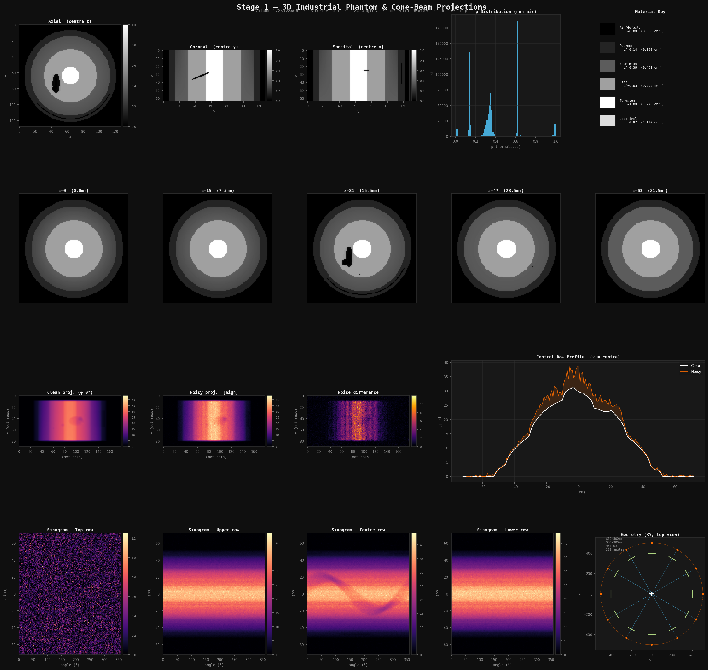

# Industrial-Grade Synthetic X-ray Data Generation

<p align="center">
  
</p>

> A physics-aware pipeline for generating fully synthetic, customisable, industrially-relevant cone-beam CT datasets — complete with realistic material composition, six defect classes, and a five-stage noise model grounded in detector physics.

---

## Overview

Benchmarking reconstruction algorithms, training deep-learning models, or studying artefact behaviour all require labelled CT data where the ground truth is **exactly known**. Real industrial scans don't give you that.

This repository generates synthetic data that is:

- **Physically grounded** — attenuation coefficients from NIST XCOM at 100 keV, Beer-Lambert forward model, Poisson photon statistics
- **Industrially relevant** — multi-material cylindrical component (turbine shaft cross-section) with six realistic defect classes
- **Fully customisable** — every material, geometry, defect position, noise level, and scanner parameter is a Python dataclass field
- **Directly usable** — outputs `.npy` volumes + `.raw` / `.tif` stacks that open in ImageJ/Fiji with one click

The pipeline has four steps that map directly to the code modules:

```
PhantomConfig  →  IndustrialPhantom  →  ConeBeamProjector  →  apply_noise  →  save / visualise
    (1)               (1)                     (3)                  (2)              (4)
```

---

## Quickstart

```bash
git clone https://github.com/ayush-chauhan-1202/Industrial_grade_synthetic_Xray_data_generation
cd Industrial_grade_synthetic_Xray_data_generation

pip install -r requirements.txt

# Default run: 128×128×64 volume, 180 angles, medium noise
python run_stage1.py

# View outputs immediately in ImageJ (drag macro onto toolbar)
# results/macros/open_all.ijm
```

Generated outputs:

```
results/
├── volume/
│   ├── phantom.npy              3D attenuation volume (Nz × Ny × Nx), float32
│   └── phantom_meta.json        physical μ values, voxel size, energy
├── projections/
│   ├── clean.npy                (n_angles × det_rows × det_cols), float32
│   ├── noisy.npy                same + full noise pipeline applied
│   └── geometry.json            scanner parameters
├── raw/                         ImageJ-importable RAW binary files
├── macros/                      ImageJ .ijm macros — one click to open
└── figures/
    ├── stage1_summary.png       ← one-page summary, start here
    ├── orthogonal.png
    ├── defect_panel.png
    ├── projection.png
    ├── sinogram_stack.png
    └── geometry.png
```

---

## Step 1 — 3D Phantom Generation

### Physical basis: X-ray attenuation

X-ray propagation through matter obeys the **Beer-Lambert law**:

$$I = I_0 \, \exp\!\left(-\int_L \mu(\mathbf{r})\, dl\right)$$

where:
- $I_0$ — incident photon intensity (blank scan)
- $I$ — transmitted intensity at the detector
- $\mu(\mathbf{r})$ — linear attenuation coefficient at position **r** (cm⁻¹)
- $\int_L dl$ — line integral along the ray path

The **attenuation coefficient** $\mu$ depends on the material and the X-ray energy. Higher $\mu$ means the material absorbs more X-rays (appears bright in attenuation images). Values used in this work are taken from the **NIST XCOM photon cross-section database** at **100 keV**:

| Material | μ (cm⁻¹) | μ (normalised) | Role in component |
|----------|----------|----------------|-------------------|
| Air / voids | 0.000 | 0.000 | Background, defects |
| CFRP polymer | 0.180 | 0.142 | Outer protective shell |
| Aluminium 7075 | 0.461 | 0.363 | Main structural body |
| Stainless steel | 0.797 | 0.627 | Inner load-bearing sleeve |
| Tungsten carbide | 1.270 | 1.000 | Core pin (hardest, densest) |
| Lead (inclusion) | 1.100 | 0.866 | Foreign fragment defect |

All volumes are stored as **normalised μ** (divided by μ_WC = 1.270 cm⁻¹) for numerical stability. The `physical_volume` property returns true cm⁻¹ values.

### Component geometry

The phantom models a **cross-section of a cylindrical industrial component** — similar to a turbine shaft insert, pressure-vessel fitting, or aerospace fastener sleeve — consisting of four concentric material layers:

```
                ┌─────────────────────────┐
                │   Polymer shell  (0.18) │  ← outer protection / composite wrap
                │  ┌───────────────────┐  │
                │  │  Aluminium body   │  │  ← structural material + corrosion zone
                │  │  ┌───────────┐   │  │
                │  │  │  Steel    │   │  │  ← inner load-bearing sleeve
                │  │  │  ┌─────┐ │   │  │
                │  │  │  │ WC  │ │   │  │  ← tungsten-carbide core pin
                │  │  │  └─────┘ │   │  │
                │  │  └───────────┘   │  │
                │  └───────────────────┘  │
                └─────────────────────────┘
                         (μ in cm⁻¹)
```

Layer boundaries are defined as **fractions of the volume half-radius**, making the geometry resolution-independent:

```python
PhantomConfig(
    r_polymer    = 0.90,   # 90% of max radius
    r_aluminium  = 0.78,
    r_steel      = 0.52,
    r_tungsten   = 0.17,
)
```

### Defect classes

Six defect types are embedded, each modelled with a distinct 3D geometry that evolves along the axial (z) axis — unlike 2D phantoms where defects are constant-cross-section extrusions:

---

#### Defect 1 — Spherical gas pores

**Physical origin:** Gas entrapment during casting or welding; solidification shrinkage; hydrogen embrittlement.

**Geometry:** Perfect spheres of configurable radius and position. Multiple pores of different sizes simulate the distribution found in real castings.

**Implementation:**
$$\text{pore mask} : \sqrt{(x-x_c)^2 + (y-y_c)^2 + (z-z_c)^2} \leq r$$

```python
pores = [
    (-0.32,  0.25, -0.10,  2.0),   # (x_frac, y_frac, z_frac, radius_mm)
    ( 0.40, -0.18,  0.20,  1.4),
    (-0.12, -0.40,  0.35,  0.8),
    ( 0.20,  0.38, -0.30,  0.6),
]
```

Positions are specified as **fractions of the volume half-extent** so they scale with the phantom size. μ inside the pore is set to 0 (air).

---

#### Defect 2 — Micro-porosity cluster

**Physical origin:** Dendritic solidification creates a band of sub-millimetre pores at material interfaces. Common at dissimilar-metal joints — here, the steel/aluminium boundary.

**Geometry:** 80 randomly placed micro-spheres (radius 0.1–0.3 mm) whose centres are constrained to stay within a jitter band around the steel/Al interface radius:

$$r_{\text{pore}} \in \left[r_{\text{steel}} - \delta_j,\; r_{\text{steel}} + \delta_j\right]$$

where $\delta_j$ = `micro_pore_jitter` × R_max. Axial position is uniformly random across the full component length, giving a realistic scattered distribution rather than a uniform ring.

---

#### Defect 3 — Tilted planar crack

**Physical origin:** Fatigue cracks grow perpendicular to the principal stress — often at an angle to the component axis in torsion-loaded shafts. Cracks narrow at their tips.

**Geometry:** A **tilted ellipsoidal disk** — a 3D ellipsoid with one very short semi-axis ($a_z = 0.8$ mm) modelling the crack thickness, and two longer axes modelling its lateral extent (10 mm × 6 mm). The ellipsoid is rotated by `crack_tilt_deg = 22°` around the y-axis:

$$\text{crack mask}: \left(\frac{x'}{a_x}\right)^2 + \left(\frac{y}{a_y}\right)^2 + \left(\frac{z'}{a_z}\right)^2 \leq 1$$

where $(x', z')$ are coordinates in the rotated frame:
$$x' = -\sin\theta \cdot z + \cos\theta \cdot x, \quad z' = \cos\theta \cdot z + \sin\theta \cdot x$$

The tilt is what makes the crack detectable from some projection angles and nearly invisible from others — a key challenge in real NDT.

---

#### Defect 4 — Dense foreign inclusion

**Physical origin:** Metallic fragments from tooling wear, contaminated feedstock, or repair welds. Lead and tungsten fragments are common in aerospace components.

**Geometry:** An **ellipsoidal inclusion** with semi-axes (2.5 mm × 1.5 mm × 1.0 mm), assigned μ = 1.100 cm⁻¹ (lead at 100 keV). This makes the inclusion appear **brighter** than surrounding material — the opposite signature of a void.

$$\text{inclusion mask}: \left(\frac{x-x_c}{a_x}\right)^2 + \left(\frac{y-y_c}{a_y}\right)^2 + \left(\frac{z-z_c}{a_z}\right)^2 \leq 1$$

---

#### Defect 5 — Cylindrical delamination

**Physical origin:** Interface failure between dissimilar materials (polymer/metal debonding) caused by thermal cycling or impact. Delaminations are planar, circumferential, and partial — rarely extending all the way around.

**Geometry:** A thin air shell ($t$ = 0.5 mm) positioned midway between the polymer and aluminium radii, covering a **partial arc** (25°–140°) in the azimuthal direction and a fraction of the axial length:

$$\text{delam mask}: \left|r_{xy} - r_{\text{delam}}\right| \leq \frac{t}{2} \;\cap\; \phi \in [\phi_{\text{start}}, \phi_{\text{end}}] \;\cap\; z \in [z_{\text{lo}}, z_{\text{hi}}]$$

The partial arc makes this defect strongly angle-dependent in projection — it disappears in views orthogonal to the delamination plane, a known challenge for cone-beam NDT.

---

#### Defect 6 — Corrosion gradient

**Physical origin:** Surface corrosion reduces material density near the outer face and progresses inward over time. In a component with one exposed end, corrosion is stronger at that end.

**Geometry:** A spatially varying μ reduction in the aluminium body, with two gradient components:

- **Radial:** Stronger near the outer aluminium surface (interface with the environment)
- **Axial:** Stronger at the z = 0 end (the exposed face)

$$\Delta\mu(r, z) = -\alpha_{\text{corr}} \cdot g_r(r) \cdot g_z(z)$$

$$g_r(r) = \text{clip}\!\left(\frac{r - r_{\text{steel}}}{r_{\text{Al}} - r_{\text{steel}}}, 0, 1\right), \quad g_z(z) = 1 - \frac{z}{N_z}$$

This is not a discrete defect — it's a **continuous property variation** that is hard to detect without quantitative reconstruction.

---

### Partial-volume effect simulation

After all defect masks are applied, the volume is convolved with a 3D Gaussian kernel (σ = 0.7 voxels):

```python
vol = gaussian_filter(vol, sigma=cfg.smooth_sigma)
```

This simulates the **partial-volume effect** — real voxels at material boundaries contain a mixture of both materials, and the measured attenuation is an average. Without this, boundaries are infinitely sharp, which never happens in a real scan.

---

## Step 2 — Noise Modelling

### Why noise matters

Clean projections are physically unrealisable. Every real detector measurement is corrupted by at least quantum noise. The noise model must be applied in the **correct physical order** — beam hardening affects the signal before it reaches the detector; Poisson statistics govern the counting process; electronic noise is added after digitisation; ring artefacts are a fixed-pattern gain variation.

### Unit convention

The projector outputs line integrals $p$ in units of **mm · cm⁻¹**. The Beer-Lambert Poisson model requires a **dimensionless optical depth** $\tau$:

$$\tau = \int \mu \, dl \quad [\text{cm}^{-1} \cdot \text{cm} = \text{dimensionless}]$$

Conversion: $\tau = p \times 0.1$ (1 mm = 0.1 cm). All noise stages operate on $\tau$; the result is converted back before saving.

### Noise pipeline (physically ordered)

#### Stage 1 — Beam hardening

**Physical basis:** Real X-ray sources emit a **polychromatic spectrum**, not monochromatic photons. Low-energy photons are preferentially absorbed (the beam "hardens" as it travels). This causes the effective attenuation to appear lower for long path lengths, producing a **cupping artefact** — reconstructed images appear brighter at the edges than at the centre even for uniform objects.

**Model:** A quadratic correction added to the clean optical depth *before* detection:

$$\tau_{\text{BH}} = \tau + c_{\text{BH}} \cdot \tau^2$$

where $c_{\text{BH}}$ is the beam-hardening coefficient (default 0.03 for medium preset). This is a first-order polynomial model of the polychromatic effect — more accurate models require full spectral simulation.

---

#### Stage 2 — Poisson (quantum) noise

**Physical basis:** X-ray detection is a **counting process**. Each detector pixel counts the number of photons that arrive in the exposure time. Photon emission and arrival are independent random events, so the count follows a **Poisson distribution**:

$$\tilde{I} \sim \mathrm{Poisson}(I_{\text{transmitted}}), \quad I_{\text{transmitted}} = I_0 \, e^{-\tau_{\text{BH}}}$$

The noisy optical depth is recovered by the log transform:

$$\tilde{\tau} = -\log\!\left(\frac{\tilde{I}}{I_0}\right)$$

The **signal-to-noise ratio** scales as $\sqrt{I_0}$. For $I_0 = 10{,}000$ photons: SNR ≈ 100 (1% noise). For $I_0 = 2{,}000$: SNR ≈ 45 (2.2% noise).

```
I0        SNR      Application
─────────────────────────────────────────────
100 000   316      High-dose medical CT
 50 000   224      Industrial (slow scan)
 10 000   100      Industrial (medium dose) ← default
  2 000    45      Industrial (low dose / fast)
```

This is the dominant noise source for all real CT systems.

---

#### Stage 3 — Gaussian (electronic) noise

**Physical basis:** Detector read-out electronics add **thermal noise and amplifier noise** independent of the photon signal. This is well-modelled as additive Gaussian noise with a fixed standard deviation.

**Model:**

$$\tilde{\tau}_e = \tilde{\tau} + \mathcal{N}(0,\, \sigma_e)$$

where $\sigma_e$ is expressed as a fraction of the **mean optical depth** (so it scales sensibly with path length). At medium preset: $\sigma_e = 0.005 \times \bar{\tau}$.

---

#### Stage 4 — Ring artefacts (detector gain variation)

**Physical basis:** Flat-panel detectors consist of thousands of individual pixels, each with a slightly different gain (sensitivity). These fixed-pattern variations appear as **concentric rings in the reconstructed image** because a consistently over- or under-sensitive detector column always occupies the same position relative to the rotation axis.

**Model:** Each detector column $u$ is multiplied by a fixed gain factor drawn once from a normal distribution:

$$\tilde{\tau}_{\text{ring}}(\cdot, u) = \tilde{\tau}(\cdot, u) \times g_u, \quad g_u \sim \mathcal{N}(1, \sigma_{\text{ring}})$$

The same $g_u$ is applied to every angle — this is what makes the pattern fixed in reconstructed space.

---

#### Stage 5 — Scatter

**Physical basis:** Compton scattering deflects photons from their original path. Some scattered photons reach the detector even though they did not travel along the straight-line path from source to pixel. This adds a **low-frequency background** that reduces contrast and causes cupping similar to beam hardening.

**Model:** A uniform additive floor proportional to the mean projection value:

$$\tilde{\tau}_{\text{scatter}} = \tilde{\tau} + f_s \cdot \bar{\tau}$$

where $f_s$ = `scatter_fraction` (default 0.005, i.e. 0.5%). A more accurate model would use a scatter kernel convolution, but this simple model captures the main effect.

---

### Noise presets

| Preset | I₀ (photons) | σ_e | Ring gain σ | BH coeff | Scatter |
|--------|-------------|-----|-------------|----------|---------|
| `noiseless` | 10⁹ | 0 | 0 | 0 | 0 |
| `low` | 50 000 | 0.002 | 0.5% | 1% | 0.2% |
| `medium` | 10 000 | 0.005 | 1.0% | 3% | 0.5% |
| `high` | 2 000 | 0.015 | 2.0% | 6% | 1.0% |

---

## Step 3 — Cone-Beam Forward Projection

### Geometry

The scanner geometry follows the standard industrial cone-beam CT convention:

```
                    Detector (flat panel)
                          │
    Source ──── ISO ───── │ ──────►  SDD
      (S)         O       │
                          │

    SID = Source-to-Isocenter Distance  (mm)
    SDD = Source-to-Detector Distance   (mm)
    Magnification M = SDD / SID
```

The X-ray source moves on a **circular trajectory** in the XY plane. At each angle $\phi$:

$$\text{Source position} = \begin{pmatrix} -\text{SID}\cos\phi \\ -\text{SID}\sin\phi \\ 0 \end{pmatrix}$$

$$\text{Detector centre} = \begin{pmatrix} (\text{SDD}-\text{SID})\cos\phi \\ (\text{SDD}-\text{SID})\sin\phi \\ 0 \end{pmatrix}$$

The **detector axes** are:
- **u-direction** (transaxial): $(-\sin\phi,\; \cos\phi,\; 0)$ — perpendicular to the source-isocenter line in XY
- **v-direction** (axial): $(0,\; 0,\; 1)$ — along the rotation axis Z

### Detector auto-sizing

The detector is automatically sized to fully cover the phantom with a 25% margin:

$$N_{\text{cols}} = \lceil N_x \cdot v_s \cdot M \;/\; d_{\text{pix}} \times 1.25 \rceil$$
$$N_{\text{rows}} = \lceil N_z \cdot v_s \cdot M \;/\; d_{\text{pix}} \times 1.25 \rceil$$

where $v_s$ = voxel size (mm), $d_{\text{pix}}$ = detector pixel pitch (mm), $M$ = magnification. This prevents the common mistake of cutting off the phantom edges.

### Ray-driven forward projection

For each projection angle $\phi$ and each detector pixel $(u, v)$:

**1. Compute the ray direction** from source to pixel:

$$\hat{d}(u,v,\phi) = \frac{\mathbf{p}(u,v,\phi) - \mathbf{s}(\phi)}{\left\|\mathbf{p}(u,v,\phi) - \mathbf{s}(\phi)\right\|}$$

**2. Parametrise the ray** using a window centred on the isocentre (not starting from the source — the source is typically 500 mm away while the volume is only ~32 mm wide):

$$\mathbf{r}(t) = \mathbf{s}(\phi) + t \cdot \hat{d}(u,v,\phi), \quad t \in [\text{SID} - 1.8 \cdot r_{\text{vol}},\; \text{SID} + 1.8 \cdot r_{\text{vol}}]$$

**3. Convert world coordinates to voxel indices:**

$$\text{axis}_0 = \frac{z_{\text{world}}}{v_s} + \frac{N_z}{2}, \quad \text{axis}_1 = \frac{y_{\text{world}}}{v_s} + \frac{N_y}{2}, \quad \text{axis}_2 = \frac{x_{\text{world}}}{v_s} + \frac{N_x}{2}$$

**4. Trilinear interpolation** at each sample point using `scipy.ndimage.map_coordinates`:

$$\mu_{\text{sample}}(t) = \sum_{i,j,k \in \{0,1\}^3} w_{ijk}(t) \cdot \mu[z_i, y_j, x_k]$$

where $w_{ijk}$ are trilinear weights. Samples outside the volume return 0 (air).

**5. Integrate** along the ray (Riemann sum):

$$p(u, v, \phi) = \sum_{n=1}^{N_s} \mu_{\text{sample}}(t_n) \cdot \Delta t$$

The output is in units of **mm · cm⁻¹** (path length × attenuation coefficient).

### Why start sampling near the isocentre?

A common implementation bug is parametrising $t$ from 0 (at the source) to $\text{diag}(\text{volume})$. But the source is typically 500 mm from the isocentre, while the volume diagonal is only ~46 mm. The ray never reaches the volume. The correct approach starts $t$ at $\text{SID} - 1.8 \times r_{\text{vol}}$ — just before the ray enters the volume.

---

## Step 4 — Visualisation and Saving

### Visualisations generated

| Figure | Content |
|--------|---------|
| `orthogonal.png` | Axial, coronal, sagittal views of the 3D phantom |
| `defect_panel.png` | 8 axial slices showing how defects evolve along z |
| `projection.png` | Single projection radiograph at φ=0° + central row profile |
| `sinogram_stack.png` | Sinograms for top, upper, centre, lower detector rows |
| `geometry.png` | Scanner geometry schematic (top view) |
| `stage1_summary.png` | One-page summary of all of the above |

### Save formats

**NumPy (`.npy`)** — lossless float32, the primary format used by all downstream reconstruction stages.

**RAW binary + ImageJ macros** — for direct import into ImageJ/Fiji without any conversion:
- Files are little-endian float32 with no header
- Filename encodes shape: `noisy_projections_180x90x180_float32.raw`
- `.ijm` macro pre-fills all import parameters — just drag onto ImageJ toolbar

**JSON metadata** — geometry and physical parameters saved alongside each array so reconstructors can load everything they need from a single folder.

---

## Configuration Reference

All phantom, geometry, and noise parameters are exposed as Python dataclass fields:

```python
from src.phantom.industrial_volume import PhantomConfig
from src.projector.conebeam import ConeBeamGeometry
from src.noise.noise_model import NoiseConfig

# Phantom
cfg = PhantomConfig(
    Nx=128, Ny=128, Nz=64,        # volume dimensions (voxels)
    voxel_size_mm=0.5,            # physical voxel pitch
    r_polymer=0.90,               # layer radii as fraction of half-width
    r_aluminium=0.78,
    r_steel=0.52,
    r_tungsten=0.17,
    corrosion_strength=0.14,      # max μ reduction in Al
    n_micro_pores=80,             # count of micro-pores at steel/Al interface
    crack_tilt_deg=22.0,          # crack tilt around y-axis
    crack_axes_mm=(10.0, 6.0, 0.8), # crack semi-axes (x, y, z)
    smooth_sigma=0.7,             # partial-volume Gaussian sigma (voxels)
    seed=42,
)

# Scanner geometry
geo = ConeBeamGeometry(
    SID=500.0,           # source-to-isocenter (mm)
    SDD=900.0,           # source-to-detector (mm) → M = 1.8×
    n_angles=180,        # projections over 360°
    det_pixel_mm=0.8,    # detector pixel pitch (mm)
)

# Noise
noise = NoiseConfig(
    photon_count=10_000,    # I0: blank-scan photons per pixel
    gaussian_sigma=0.005,   # electronic noise (fraction of mean τ)
    ring_strength=0.010,    # detector gain variation σ
    beam_hardening=0.030,   # BH polynomial coefficient
    scatter_fraction=0.005, # Compton scatter floor
    seed=42,
)
```

---

## CLI Reference

```bash
python run_stage1.py [OPTIONS]

Volume
  --Nx INT            Width  (default: 128)
  --Ny INT            Height (default: 128)
  --Nz INT            Depth  (default: 64)
  --vox-mm FLOAT      Voxel size in mm  (default: 0.5)

Scanner geometry
  --SID FLOAT         Source-isocenter distance mm  (default: 500)
  --SDD FLOAT         Source-detector distance mm   (default: 900)
  --n-angles INT      Projection angles             (default: 180)
  --det-px FLOAT      Detector pixel pitch mm       (default: 0.8)

Noise
  --noise STR         Preset: noiseless/low/medium/high  (default: medium)

Output
  --seed INT          RNG seed  (default: 42)
  --out-dir PATH      Output directory  (default: results)
  --save-raw          Export RAW + ImageJ macros
  --no-figure         Skip figure rendering
  --fast              Reduce ray samples (less accurate, faster)
```

---

## Project Structure

```
├── run_stage1.py                   entry point — run this
├── save_as_raw.py                  export .raw + .ijm for ImageJ
├── src/
│   ├── phantom/
│   │   └── industrial_volume.py   PhantomConfig + IndustrialPhantom
│   ├── projector/
│   │   └── conebeam.py            ConeBeamGeometry + ConeBeamProjector
│   ├── noise/
│   │   └── noise_model.py         NoiseConfig + apply_noise + PRESETS
│   └── visualization/
│       └── visualize.py           all figure functions
├── results/                       generated on first run
├── requirements.txt
└── README.md
```

---

## Dependencies

```
numpy >= 1.24
scipy >= 1.10
scikit-image >= 0.21
matplotlib >= 3.7
```

No GPU required. A 128×128×64 volume with 180 projection angles runs in approximately **2 minutes** on a standard laptop CPU.

---

## Extending the Dataset

**New material:** Add an entry to `MU_PHYSICAL` in `industrial_volume.py` and reference it in `_build()`.

**New defect shape:** Any boolean 3D mask can be used. For a cylindrical bore: `mask = (R_xy <= r) & (np.abs(Z - z_centre) <= half_height)`.

**Different geometry (fan-beam, parallel-beam):** Replace `ConeBeamProjector` with a 2D projector (e.g., using `skimage.transform.radon`). The noise and phantom modules are geometry-agnostic.

**Larger volumes:** The projector scales linearly with `Nx × Ny × Nz × n_angles × n_samples`. For 512³ volumes, consider implementing the forward projector with CuPy for GPU acceleration.

---

## Physical Validity Checklist

| Claim | Basis |
|-------|-------|
| Attenuation coefficients | NIST XCOM database, 100 keV |
| Poisson noise model | Beer-Lambert + photon counting statistics |
| Beam hardening | First-order polynomial model of polychromatic spectra |
| Detector ring artefacts | Fixed-pattern multiplicative gain model |
| Compton scatter | Uniform additive floor (approximate) |
| Partial-volume effect | Gaussian smoothing at material boundaries |
| Cone-beam magnification | Exact: M = SDD/SID |
| Detector coverage | Auto-sized to cover phantom × 1.25 margin |

---

## References

1. **NIST XCOM** — Photon cross-section database. https://physics.nist.gov/PhysRefData/Xcom/
2. **Buzug, T.M.** (2008). *Computed Tomography: From Photon Statistics to Modern Cone-Beam CT.* Springer.
3. **Feldkamp, L.A., Davis, L.C., Kress, J.W.** (1984). Practical cone-beam algorithm. *JOSA A*, 1(6), 612–619.
4. **Kak, A.C., Slaney, M.** (1988). *Principles of Computerized Tomographic Imaging.* IEEE Press. [Free PDF](https://engineering.purdue.edu/~malcolm/pct/)
5. **Barrett, H.H., Swindell, W.** (1981). *Radiological Imaging.* Academic Press.

---

## License

MIT License — see `LICENSE` for details.


